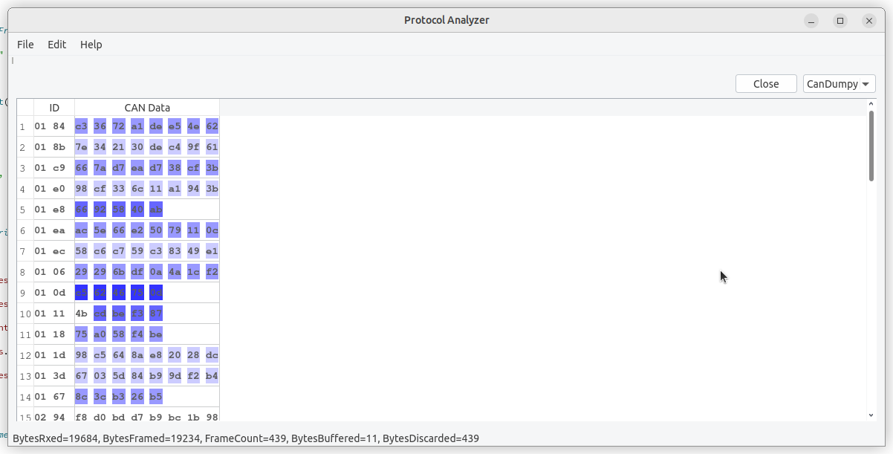

# CanDumpy

Plugin for [PAHSDA](https://github.com/mwales/pahsda)

Was playing about at DEFCON 31 and the Vehicle Hacking Village had a CTF.  I
tried looking at some challenges, and came across one that had a dump from a
CAN dumper in text format.  I decided to update my PAHSDA tool with a plugin
that could injest the CAN data.

At first I thought the CAN data was a full CAN frame, but I don't think it was
after all, I think it was just timestamp, CAN-ID, and data frame.

I've included the CAN dump that was part of the CTF.  I don't even remember
what the point of the challenge was at this point, but I can now load the
dump file into PAHSDA.

